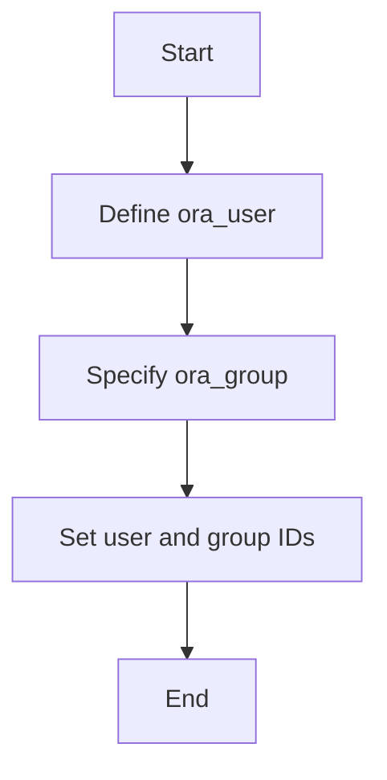
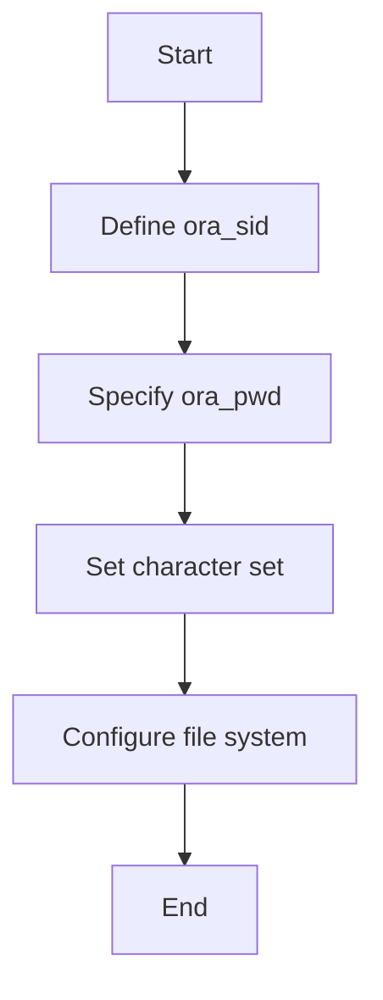

# Exploring Oracle Configuration Parameters

Oracle Parameters are essential configurations required for the installation and setup of an Oracle Single Instance database on an AIX operating system. These parameters include details such as the work directory on the target system, binary location, and NFS details if the binary location is set to NFS. They also define user and group information, such as the Oracle user, group, and their respective IDs. Additionally, Oracle Parameters specify the Oracle SID, password, character set, and various file system and volume group configurations. These parameters ensure that the Oracle database is installed correctly and operates efficiently by providing necessary paths, user credentials, and storage configurations.

<SwmSnippet path="/vars/oracle_params.yml" line="4">

---

## Work Directory and Binary Location

The <SwmToken path="vars/oracle_params.yml" pos="5:0:0" line-data="work_dir:   &amp;work_dir &quot;/tmp/ansible&quot;">`work_dir`</SwmToken> and <SwmToken path="vars/oracle_params.yml" pos="11:0:0" line-data="ora_binary_location: nfs">`ora_binary_location`</SwmToken> parameters specify the working directory and the location of Oracle binaries, respectively.

```yaml
# Provide the ansible work directory on target system
work_dir:   &work_dir "/tmp/ansible"

# binary location can be remote|local|nfs
# remote : Ansible Controller location defined in oracledbaix19c & oraclegridaix19c
# local: Local location of Target Hosts
# nfs: Network File system location
ora_binary_location: nfs
```

---

</SwmSnippet>

The <SwmToken path="vars/oracle_params.yml" pos="5:0:0" line-data="work_dir:   &amp;work_dir &quot;/tmp/ansible&quot;">`work_dir`</SwmToken> parameter defines the Ansible work directory on the target system, while the <SwmToken path="vars/oracle_params.yml" pos="11:0:0" line-data="ora_binary_location: nfs">`ora_binary_location`</SwmToken> parameter specifies the location of Oracle binaries, which can be remote, local, or NFS.

<SwmSnippet path="/vars/oracle_params.yml" line="48">

---

## User and Group Information

The <SwmToken path="vars/oracle_params.yml" pos="48:0:0" line-data="ora_user: oracle">`ora_user`</SwmToken>, <SwmToken path="vars/oracle_params.yml" pos="50:0:0" line-data="ora_group: dba">`ora_group`</SwmToken>, and related parameters define the Oracle user and group information.

```yaml
ora_user: oracle
ora_user_uid: 600 
ora_group: dba
ora_group_gid: 500
ora_oinstall_group: oinstall
ora_oinstall_group_gid: 501
ora_oper_group: oper
ora_oper_group_gid: 503
ora_home_profile: /home/{{ora_user}}
ora_install_group: oinstall
ora_asmdba_group: asmdba
ora_asmoper_group: asmoper
ora_asmadmin_group: asmadmin
ora_asmdba_group_gid: 504
ora_asmoper_group_gid: 505
ora_asmadmin_group_gid: 506
```

---

</SwmSnippet>

The <SwmToken path="vars/oracle_params.yml" pos="48:0:0" line-data="ora_user: oracle">`ora_user`</SwmToken>, <SwmToken path="vars/oracle_params.yml" pos="50:0:0" line-data="ora_group: dba">`ora_group`</SwmToken>, and related parameters define the Oracle user and group information, including their respective IDs. This ensures that the Oracle database has the correct user permissions and group associations for its operations.



<SwmSnippet path="/vars/oracle_params.yml" line="70">

---

## Oracle SID, Password, and File System Configurations

The <SwmToken path="vars/oracle_params.yml" pos="70:0:0" line-data="ora_sid: orcl ">`ora_sid`</SwmToken>, <SwmToken path="vars/oracle_params.yml" pos="71:0:0" line-data="ora_pwd: Oracle4u">`ora_pwd`</SwmToken>, and related parameters specify the Oracle SID, password, character set, and file system configurations.

```yaml
ora_sid: orcl 
ora_pwd: Oracle4u
ora_character_set: WE8MSWIN1252

ora_sw_vg: oravg
ora_sw_vg_disk:  ['hdisk1','hdisk2']
ora_sw_fs: "/u01"
ora_sw_fs_size: 200G
ru_tgt_path: "{{ora_sw_fs}}/RU19"
ora_inventory: "{{ora_sw_fs}}/oraInventory"
ora_base: "{{ora_sw_fs}}/base"
ora_home: "{{ora_sw_fs}}/product/{{ora_version}}/database"
```

---

</SwmSnippet>

The <SwmToken path="vars/oracle_params.yml" pos="70:0:0" line-data="ora_sid: orcl ">`ora_sid`</SwmToken>, <SwmToken path="vars/oracle_params.yml" pos="71:0:0" line-data="ora_pwd: Oracle4u">`ora_pwd`</SwmToken>, and related parameters specify the Oracle SID, password, character set, and file system configurations. These parameters are crucial for defining the Oracle database instance, its security credentials, and the storage configurations required for its operation.



&nbsp;

*This is an auto-generated document by Swimm 🌊 and has not yet been verified by a human*

<SwmMeta version="3.0.0" repo-id="Z2l0aHViJTNBJTNBYW5zaWJsZS1wb3dlci1haXgtb3JhY2xlJTNBJTNBU3dpbW0tRGVtbw==" repo-name="ansible-power-aix-oracle"><sup>Powered by [Swimm](/)</sup></SwmMeta>
