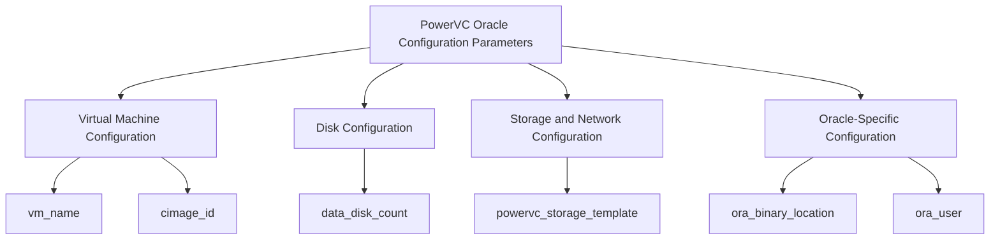

# Getting Started with <SwmToken path="vars/powervc_oracle_params.yml" pos="2:28:28" line-data="# This file is defining Oracle Variables needed for oracle single instance installation on PowerVC AIX VM">`PowerVC`</SwmToken> Oracle Configuration Parameters

<SwmToken path="vars/powervc_oracle_params.yml" pos="2:28:28" line-data="# This file is defining Oracle Variables needed for oracle single instance installation on PowerVC AIX VM">`PowerVC`</SwmToken> Oracle Parameters are a set of variables defined to facilitate the installation and configuration of an Oracle Single Instance database on a <SwmToken path="vars/powervc_oracle_params.yml" pos="2:28:28" line-data="# This file is defining Oracle Variables needed for oracle single instance installation on PowerVC AIX VM">`PowerVC`</SwmToken> managed AIX virtual machine. These parameters include details such as the virtual machine name, image ID, profile, network, and storage configurations.

## Virtual Machine Configuration

The parameters for configuring the virtual machine include <SwmToken path="vars/powervc_oracle_params.yml" pos="5:0:0" line-data="vm_name: &quot;oravm&quot;">`vm_name`</SwmToken>, <SwmToken path="vars/powervc_oracle_params.yml" pos="6:0:0" line-data="cimage_id: &quot;9437d7e3-14de-4865-a13b-12479fa05909&quot;">`cimage_id`</SwmToken>, <SwmToken path="vars/powervc_oracle_params.yml" pos="7:0:0" line-data="vm_profile: &quot;medium&quot;">`vm_profile`</SwmToken>, and <SwmToken path="vars/powervc_oracle_params.yml" pos="8:0:0" line-data="vm_network: &quot;Network129&quot;">`vm_network`</SwmToken>. For example, <SwmToken path="vars/powervc_oracle_params.yml" pos="5:0:0" line-data="vm_name: &quot;oravm&quot;">`vm_name`</SwmToken> specifies the name of the virtual machine, and <SwmToken path="vars/powervc_oracle_params.yml" pos="6:0:0" line-data="cimage_id: &quot;9437d7e3-14de-4865-a13b-12479fa05909&quot;">`cimage_id`</SwmToken> provides the ID of the image to be used.

<SwmSnippet path="/vars/powervc_oracle_params.yml" line="5">

---

The <SwmToken path="vars/powervc_oracle_params.yml" pos="5:0:0" line-data="vm_name: &quot;oravm&quot;">`vm_name`</SwmToken> parameter specifies the name of the virtual machine. This is crucial for identifying the VM within the <SwmToken path="vars/powervc_oracle_params.yml" pos="2:28:28" line-data="# This file is defining Oracle Variables needed for oracle single instance installation on PowerVC AIX VM">`PowerVC`</SwmToken> environment.

```yaml
vm_name: "oravm"
cimage_id: "9437d7e3-14de-4865-a13b-12479fa05909"
```

---

</SwmSnippet>

## Disk Configuration

The parameters define disk configurations, including the size and count of data disks, as well as their naming conventions. For instance, <SwmToken path="vars/powervc_oracle_params.yml" pos="10:0:0" line-data="data_disk_count: 3 ">`data_disk_count`</SwmToken> and <SwmToken path="vars/powervc_oracle_params.yml" pos="11:0:0" line-data="data_disk_size: 20">`data_disk_size`</SwmToken> specify the number and size of the data disks, respectively.

<SwmSnippet path="/vars/powervc_oracle_params.yml" line="10">

---

The <SwmToken path="vars/powervc_oracle_params.yml" pos="10:0:0" line-data="data_disk_count: 3 ">`data_disk_count`</SwmToken> parameter specifies the number of data disks to be attached to the virtual machine. This helps in defining the storage capacity for the Oracle database.

```yaml
data_disk_count: 3 
data_disk_size: 20
```

---

</SwmSnippet>

## Storage and Network Configuration

The parameters also include storage templates and network configurations specific to <SwmToken path="vars/powervc_oracle_params.yml" pos="2:28:28" line-data="# This file is defining Oracle Variables needed for oracle single instance installation on PowerVC AIX VM">`PowerVC`</SwmToken>, such as <SwmToken path="vars/powervc_oracle_params.yml" pos="14:0:0" line-data="powervc_storage_template: &quot;FS5000 base template&quot;">`powervc_storage_template`</SwmToken> and <SwmToken path="vars/powervc_oracle_params.yml" pos="8:0:0" line-data="vm_network: &quot;Network129&quot;">`vm_network`</SwmToken>.

<SwmSnippet path="/vars/powervc_oracle_params.yml" line="14">

---

The <SwmToken path="vars/powervc_oracle_params.yml" pos="14:0:0" line-data="powervc_storage_template: &quot;FS5000 base template&quot;">`powervc_storage_template`</SwmToken> parameter specifies the storage template to be used. This ensures that the correct storage configuration is applied.

```yaml
powervc_storage_template: "FS5000 base template"

```

---

</SwmSnippet>

## Oracle-Specific Configuration

The parameters cover Oracle-specific configurations needed for deployment, such as the location of Oracle binaries, user and group details, and Oracle-specific directories and file systems.

<SwmSnippet path="/vars/powervc_oracle_params.yml" line="25">

---

The <SwmToken path="vars/powervc_oracle_params.yml" pos="25:0:0" line-data="ora_binary_location: local ">`ora_binary_location`</SwmToken> parameter defines the location of Oracle binaries, which can be remote, local, or on a network file system (NFS). This parameter is essential for locating the Oracle installation files.

```yaml
ora_binary_location: local 
ora_parent_dir: "/orabin/19c"
```

---

</SwmSnippet>

<SwmSnippet path="/vars/powervc_oracle_params.yml" line="61">

---

The <SwmToken path="vars/powervc_oracle_params.yml" pos="61:0:0" line-data="ora_user: oracle">`ora_user`</SwmToken> parameter specifies the Oracle user that will be used for the installation and management of the Oracle database. This user must have the necessary permissions to perform these tasks.

```yaml
ora_user: oracle
ora_user_uid: 600 
```

---

</SwmSnippet>



&nbsp;

*This is an auto-generated document by Swimm 🌊 and has not yet been verified by a human*

<SwmMeta version="3.0.0" repo-id="Z2l0aHViJTNBJTNBYW5zaWJsZS1wb3dlci1haXgtb3JhY2xlJTNBJTNBU3dpbW0tRGVtbw==" repo-name="ansible-power-aix-oracle"><sup>Powered by [Swimm](/)</sup></SwmMeta>
