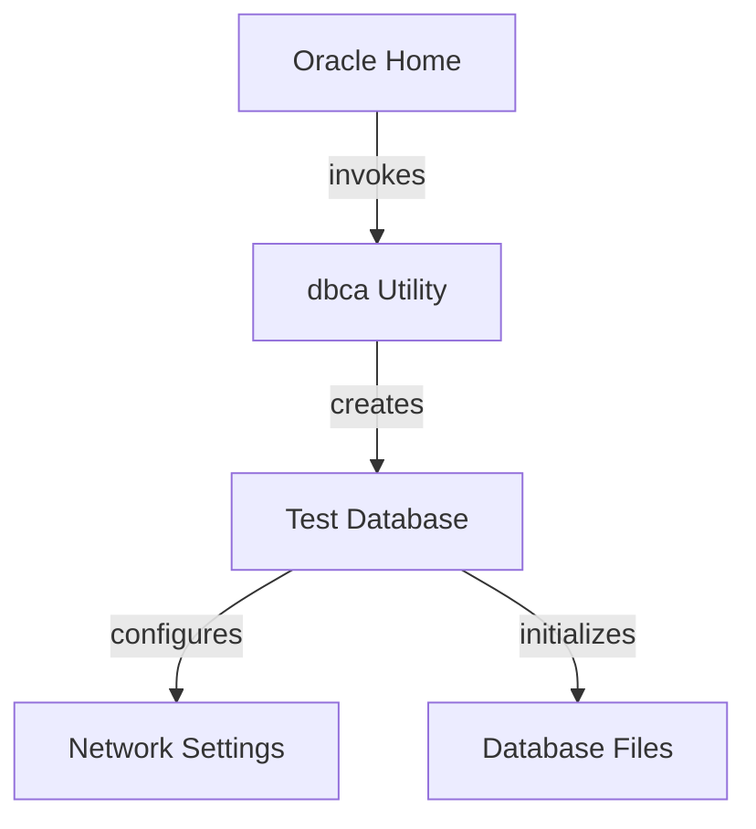

# Introduction to Oracle Database Creation

Oracle Database Creation involves using the `dbca` utility from Oracle Home to create a test database. The role responsible for this task is `oracle_createdb`, which is defined in the <SwmPath>[roles/oracle_createdb/](roles/oracle_createdb/)</SwmPath> directory. This role does not have any specific requirements and relies on variables defined in <SwmPath>[vars/oracle_params.yml](vars/oracle_params.yml)</SwmPath>. The `oracle_createdb` role depends on the `oracle_install` role to ensure that the Oracle software is installed before creating the database.

# Main Functions

There are several main functions in Oracle Database Creation. Some of them are the `dbca` utility and the `oracle_createdb` role. We will dive a little into both.

## dbca Utility

The `dbca` (Database Configuration Assistant) utility is a command-line tool provided by Oracle to create and configure Oracle databases. It automates the process of creating a database, including setting up the necessary files, initializing the database, and configuring the network settings. The `dbca` utility is invoked from the Oracle Home directory and is essential for creating a test database in an automated manner.

## oracle_createdb Role

The `oracle_createdb` role is responsible for orchestrating the database creation process using the `dbca` utility. This role is defined in the <SwmPath>[roles/oracle_createdb/](roles/oracle_createdb/)</SwmPath> directory and relies on variables specified in <SwmPath>[vars/oracle_params.yml](vars/oracle_params.yml)</SwmPath>. The `oracle_createdb` role ensures that the Oracle software is installed by depending on the `oracle_install` role before proceeding with the database creation. This role simplifies the database creation process by encapsulating the necessary steps and configurations.

# Example Playbook

The example playbook demonstrates how to use the `oracle_createdb` role to create a test database on an AIX host.

&nbsp;

*This is an auto-generated document by Swimm 🌊 and has not yet been verified by a human*

<SwmMeta version="3.0.0" repo-id="Z2l0aHViJTNBJTNBYW5zaWJsZS1wb3dlci1haXgtb3JhY2xlJTNBJTNBU3dpbW0tRGVtbw==" repo-name="ansible-power-aix-oracle">Powered by [Swimm](/)</SwmMeta>
