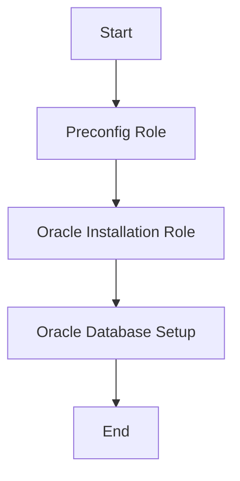

# Introduction to Oracle Installation Role

The Oracle Installation role is designed to automate the installation of the Oracle Single Instance database on a new AIX operating system. This role ensures that the Oracle database is properly set up and configured.

# Role Dependencies

The Oracle Installation role depends on the preconfig role to ensure that the system is prepared for the Oracle installation. This dependency ensures that all necessary prerequisites are met before the Oracle database installation begins.

# Configuration

The role does not have any specific requirements and relies on predefined variables for configuration. These variables should be defined in your playbook or <SwmPath>[inventory](inventory)</SwmPath> to customize the installation process according to your needs.

This example playbook demonstrates how to include the `oracle_install` role to automate the Oracle installation process on AIX systems.

&nbsp;

*This is an auto-generated document by Swimm 🌊 and has not yet been verified by a human*

<SwmMeta version="3.0.0" repo-id="Z2l0aHViJTNBJTNBYW5zaWJsZS1wb3dlci1haXgtb3JhY2xlJTNBJTNBU3dpbW0tRGVtbw==" repo-name="ansible-power-aix-oracle">Powered by [Swimm](/)</SwmMeta>
