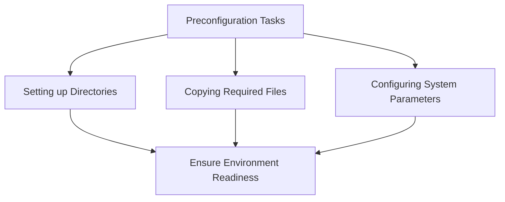

# Understanding Preconfiguration in Roles

Preconfiguration refers to the initial setup tasks that need to be performed before the main automation tasks can be executed. It includes setting up necessary directories, copying required files, and configuring system parameters. These tasks ensure that the environment is ready for the subsequent roles to be executed smoothly.

In the roles directory, the preconfig role contains various subdirectories like meta, tasks, files, and defaults, which organize the preconfiguration tasks and resources.

The <SwmPath>[README.md](README.md)</SwmPath> file in the <SwmPath>[roles/preconfig/](roles/preconfig/)</SwmPath> directory provides an overview of the preconfiguration tasks and their purpose.

&nbsp;

*This is an auto-generated document by Swimm 🌊 and has not yet been verified by a human*

<SwmMeta version="3.0.0" repo-id="Z2l0aHViJTNBJTNBYW5zaWJsZS1wb3dlci1haXgtb3JhY2xlJTNBJTNBU3dpbW0tRGVtbw==" repo-name="ansible-power-aix-oracle">Powered by [Swimm](/)</SwmMeta>
